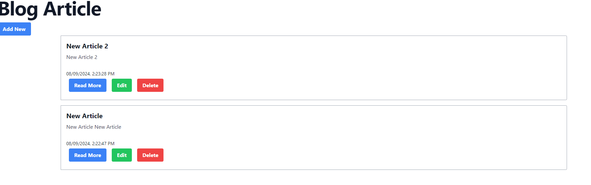

# Markdown Blog Post Project

This project is a Markdown blog post application built with Express.js, MongoDB, and Tailwind CSS.




## Features

- Allows users to create, edit, and delete Markdown blog posts.
- Parses Markdown content and renders it as HTML for display.
- Uses MongoDB to store blog post data.
- Styled using Tailwind CSS for a clean and modern design.

## Prerequisites

Make sure you have the following installed:

- Node.js and npm: [Download Node.js](https://nodejs.org/)
- MongoDB:Install mongo DB or use MongoDB atlas

## Getting Started

1. Clone the repository:

<<<<<<< HEAD

```bash
git clone https://github.com/riyazpt/markdown-blog.git
```

2. Navigate to the project directory:

   ```bash
   cd markdown-blog
   ```

3. Install dependencies:

   ```bash
   npm install
   ```

4. Set up environment variables:

=======
`bash
    git clone https://github.com/riyazpt/markdown-blog.git
    `

2. Navigate to the project directory:

   ```bash
   cd markdown-blog
   ```

3. Install dependencies:

   ```bash
   npm install
   ```

4. Set up environment variables:

> > > > > > > 54b30321a123cc01ca62587d5ab21adadbc9245c

- Create a `.env` file in the root directory of the project.
- Add the following environment variables:

  ```
  PORT=3000
  MONGODB_URI=mongodb://localhost:27017/markdown-blog
  ```

  Adjust the `PORT` and `MONGODB_URI` values as needed.

5. Start the server:

<<<<<<< HEAD

```bash
npm start
```

6. Access the application in your browser:

   ```
   http://localhost:3000
   ```

   =======
   `bash
    npm start
    `

7. Access the application in your browser:

   ```
   http://localhost:3000
   ```

> > > > > > > 54b30321a123cc01ca62587d5ab21adadbc9245c
